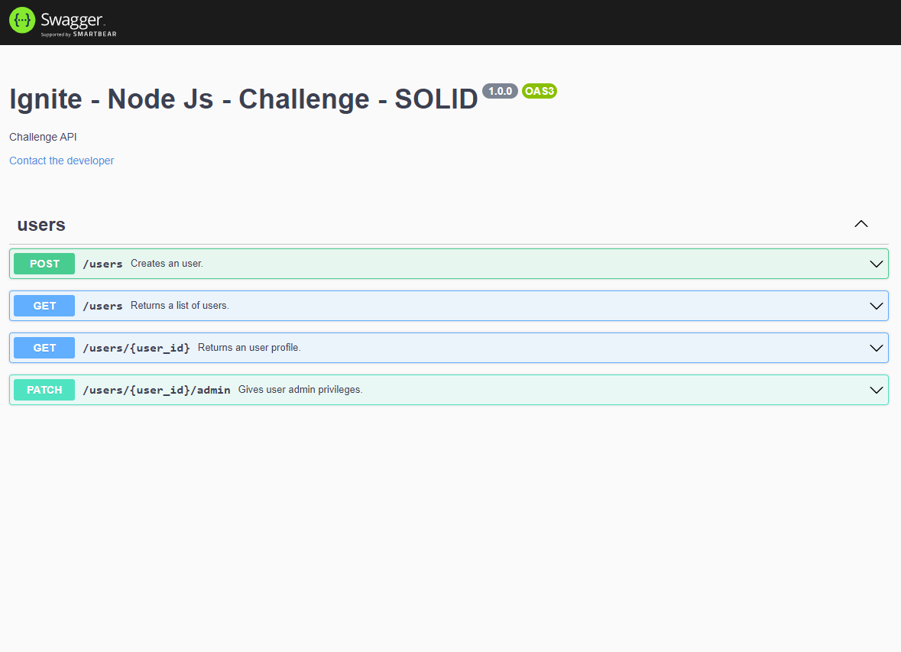

# Introduction to SOLID principles

## Dependency Inversion Principle (DIP)



> "The Dependency Inversion Principle (DIP) tells us that the most flexible systems are those in which source code dependencies refer only to abstractions, not to concretions" - Uncle bob.

Robert C. Martin states that: a. High-level modules should not depend on low-level modules, both should depend on abstractions; b. Abstractions should not depend on details, details should depend on abstractions.

High-level modules determine the interface that the low-level modules must implement. Since details follow the interface abstractions, a low-level module can change its details as long as the contract is fulfilled. Otherwise, if an abstraction depends on a detail, a low-level modification would also cause a modification on high-level.

```js
class UsersService {
  constructor(private usersRepository: IUsersRepository) {}
  ...
}
```

"UsersService" determines the "usersRepository" dependency behavior by defining the "IUsersRepository" interface or contract, respecting that details should depend on abstractions.

## Liskov Substitution Principle (LSP)

This principle says to build software systems from interchangeable parts that must adhere to a contract, which allows those parts substitutes for one another. For example, picturing that "usersRepository" needs to be modified to "mongoUsersRepository", when calling the "UsersService" constructor, it only has to pass the new object, and the application will not break since both "usersRepository" and "mongoUsersRepository" implements the IUsersRepository interface or contract.

## Dependency Injection

```js
const usersRepository = UsersRepository.getInstance();
const createUserUseCase = new CreateUserUseCase(usersRepository);
const createUserController = new CreateUserController(createUserUseCase);
```

The dependencies are provided externally, ready to be used, their creations and configuration responsibilities are made outside the dependent class. Following DIP and LSP, the injected class properly decouples from its services.

The dependencies are passed into an object through constructors. [From Wikipedia](https://en.wikipedia.org/wiki/Dependency_injection#Constructor_injection), this is the most common form of dependency injection.

<hr>

## Swagger API Documentation


